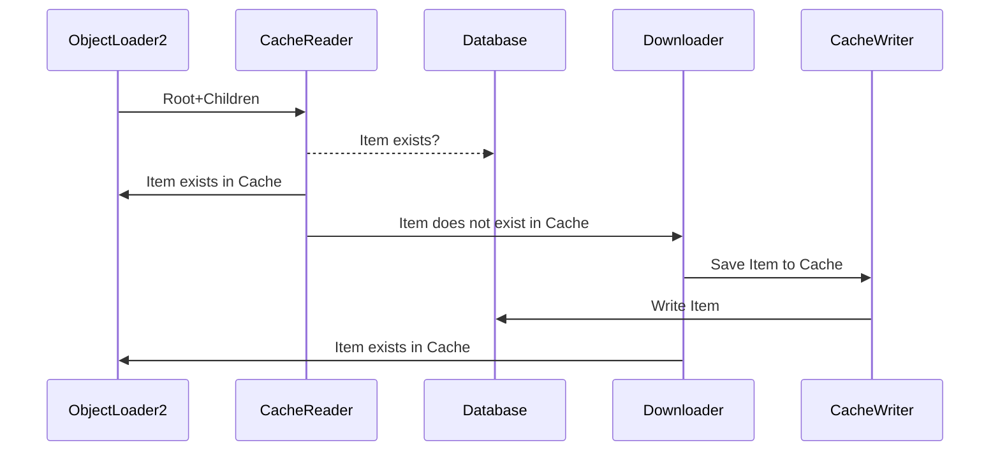
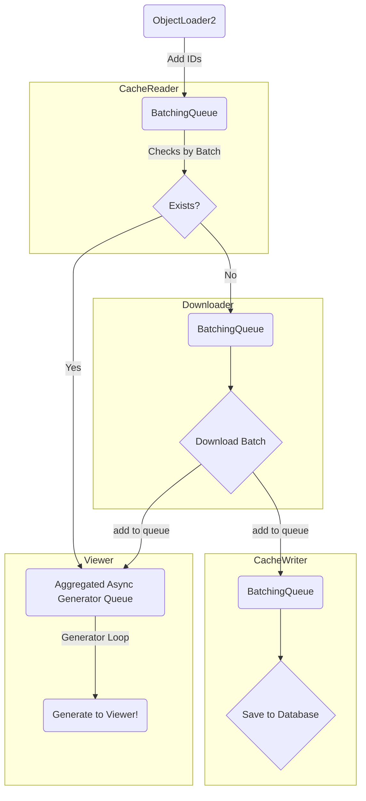

# objectloader2 for the Speckle viewer

This is an updated object loader for the Speckle viewer rewritten in Typescript.

The main aim for the objectloader is:

- download Speckle objects as JSON
- cache in IndexedDB so the same objects aren't downloaded twice
- give data to the viewer, as returned by the `getObjectIterator` generator, as soon as possible
- do the above as concurrently as a browser allows

## Architecture

To achieve increased concurrency, the different phases of the objectloader are divided into pools of workers with queues to feed them. Below is a sequence diagram of the worker stages

The queues between stages are illustrated below with the concurrency

From the list of IDs, they are moved to a queue to be begin checking the cache from a pool of readers.

Results are then sent to the viewer, if found, else they're send to the download queue.

The download queue is a batching mechanism that gets what is available, up to a limit or a timeout. The results are parsed and given to the generator and written to another queue.

The write cache queue is processed with a single writer to the indexeddb.

## Deferment

Deferment is what happens with the viewer does a random access to OL2. It returns a promise but it will be fulfilled later if the item isn't in memory.

The `DefermentManager` only holds a subset of the model in memory. If the requested item isn't in memory, then it enqueues the request into the general process laid out above.

When items are returned to the generator loop, `undefer` is called which caches the item in the manager as well as fulfills any outstanding promises.

A cleanup process is ran to be a singleton process. This process sorts by the total number of requests and the size. If anything falls outside the size window, then it is removed from the manager's memory cache.

The aim is to speed up random access while still getting items from the cache in batches. Items that are accessed randomly tend to be references in the model.

## Loader options

These can be use via a query string parameter. For example: `https://app.speckle.systems/projects/57bbfabd80/models/81b8d76ef1` can have debug logging enabled with: `https://app.speckle.systems/projects/57bbfabd80/models/81b8d76ef1?debug=true`

Current parameters:

| Parameter  | Default | Type    |
| ---------- | ------- | ------- |
| `debug`    | `false` | boolean |
| `useCache` | `true`  | boolean |
