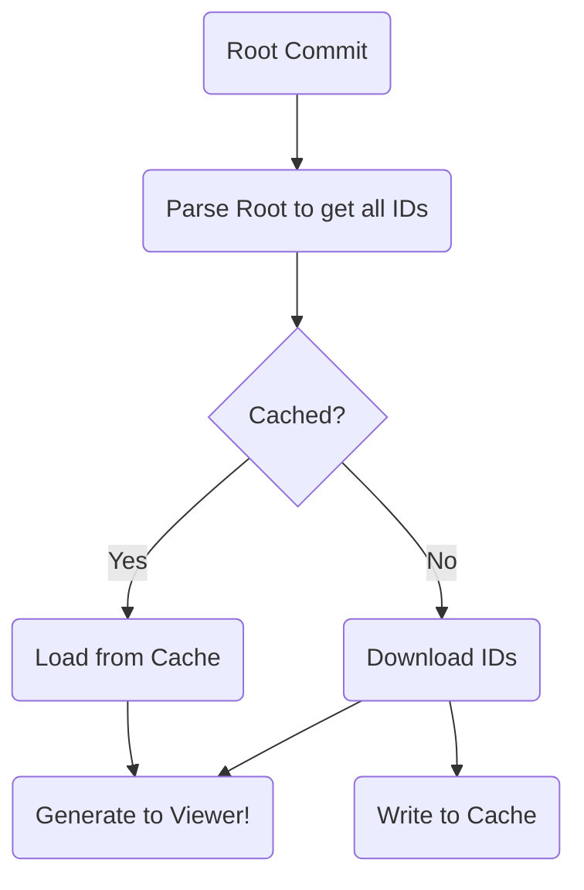

# objectloader2 for the Speckle viewer

This is an updated object loader for the Speckle viewer rewritten in Typescript.

The main aim for the objectloader is:

- download Speckle objects as JSON
- cache in IndexedDB so the same objects aren't downloaded twice
- give data to the viewer, as returned by the `getObjectIterator` generator, as soon as possible
- do the above as concurrently as a browser allows

## Architecture

To achieve increased concurrency, the different phases of the objectloader are divided into pools of workers with queues to feed them.

From the list of IDs, they are moved to a queue to be begin checking the cache from a pool of readers.

Results are then sent to the viewer, if found, else they're send to the download queue.

The download queue is a batching mechanism that gets what is available, up to a limit or a timeout. The results are parsed and given to the generator and written to another queue.

The write cache queue is processed with a single writer to the indexeddb.
