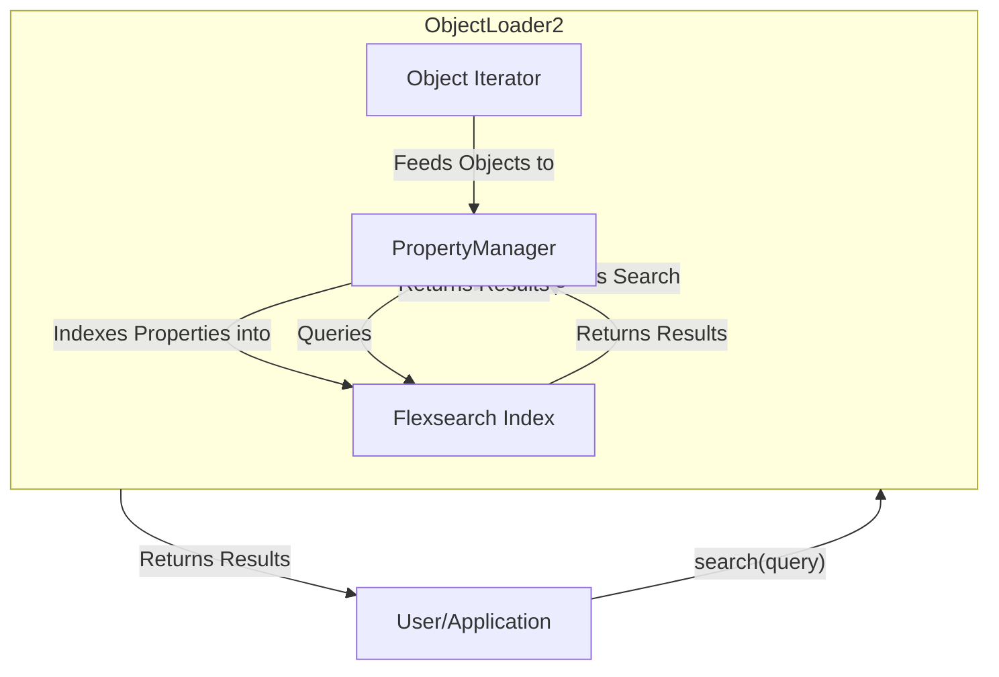

# PropertyManager Documentation

## 1. Introduction

The `PropertyManager` is an integrated component of `ObjectLoader2` that provides powerful property indexing and search capabilities. It uses `Flexsearch` for high-performance querying and supports `AND`/`OR` logic for complex searches. The `PropertyManager` is managed internally by `ObjectLoader2`, and its functionality is exposed directly through the `ObjectLoader2` API.

## 2. Architecture Overview

The `PropertyManager` is embedded within `ObjectLoader2`. As `ObjectLoader2` processes objects, it automatically feeds them to the internal `PropertyManager` instance for indexing. This creates a seamless data ingestion pipeline where property indexing occurs in the background.



## 3. Key Features

### Automatic Indexing

As `ObjectLoader2` loads objects, it automatically indexes their properties using the internal `PropertyManager`. This on-the-fly indexing means that you can start searching for properties as soon as the data begins to load, without waiting for the entire dataset to be processed.

### Advanced Search Queries

`ObjectLoader2` supports sophisticated search queries using `AND` and `OR` logical operators. Queries are provided as a pre-parsed JavaScript object, allowing for structured and precise search criteria.

**Query Object Format:**
The `search` method on `ObjectLoader2` expects a `SearchQuery` object, which is defined in `types.ts` and has the following structure:

```typescript
export interface SearchQuery {
  operator: 'AND' | 'OR';
  queries: Array<{
    key: string;
    value: string;
    exact?: boolean; // Optional: true for exact match, false for fuzzy/partial
  }>;
}
```

**Examples:**

* **AND Query:** To find objects that have `propertyA` equal to `value1` AND `propertyB` equal to `value2`:

    ```typescript
    const query = {
      operator: 'AND',
      queries: [
        { key: 'propertyA', value: 'value1' },
        { key: 'propertyB', value: 'value2' }
      ]
    };
    const results = await objectLoader.search(query);
    ```

* **OR Query:** To find objects that have `propertyC` equal to `value3` OR `propertyD` equal to `value4`:

    ```typescript
    const query = {
      operator: 'OR',
      queries: [
        { key: 'propertyC', value: 'value3' },
        { key: 'propertyD', value: 'value4' }
      ]
    };
    const results = await objectLoader.search(query);
    ```

### Property Handling

The `PropertyManager` is designed to work with the `Base` object type from `types.ts`. It automatically flattens the `properties` field of each `Base` object, making all nested properties searchable by their `key` and `value`.

## 4. API Reference

The property search functionality is exposed through the `ObjectLoader2` class.

### `ObjectLoader2` Class

#### `search(query: SearchQuery): Promise<SearchResult[]>`

Executes a search query against the indexed properties.

* `query`: An object defining the search criteria.
* **Returns:** A `Promise` that resolves to an array of `SearchResult` objects.

#### `clearPropertyIndex(): void`

Clears all indexed properties, resetting the search index.

### Interfaces

The `SearchQuery` and `SearchResult` interfaces are defined in `../objectloader2/src/types/types.ts`.

## 5. Usage Example

### Initializing, Loading, and Searching

```typescript
import { ObjectLoader2, SearchQuery } from 'your-object-loader2-path'; // Update with correct path

// 1. Initialize ObjectLoader2
const objectLoader = new ObjectLoader2({
  // ... your configuration
});

// 2. Load objects (indexing happens automatically)
for await (const obj of objectLoader.getObjectIterator()) {
  // You can process objects here if needed
}

// 3. Perform a search
const andQuery: SearchQuery = {
  operator: 'AND',
  queries: [
    { key: 'category', value: 'Beam' },
    { key: 'material', value: 'Concrete', exact: true }
  ]
};
const andResults = await objectLoader.search(andQuery);
console.log('AND Search Results:', andResults);

// 4. Clear the index if needed
objectLoader.clearPropertyIndex();
```
