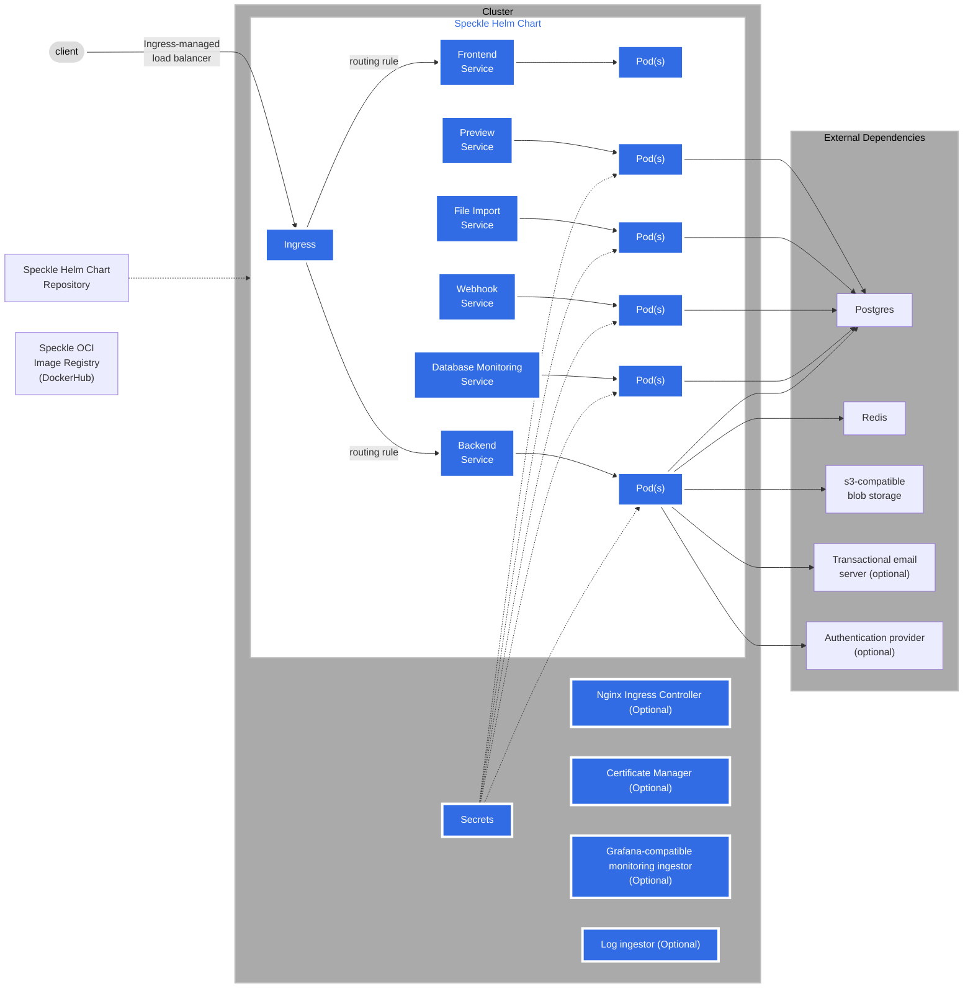

# Schematic Diagram

```mermaid
graph LR;
 client([client])-->|Ingress-managed <br> load balancer|ingress[Ingress];
 helmrepo["Speckle Helm Chart <br> Repository"]
 click helmrepo "https://specklesystems.github.io/helm/" _blank
 imageregistry["Speckle OCI <br> Image Registry <br> (DockerHub)"]
 click imageregistry "https://hub.docker.com/r/speckle/speckle-server" _blank
 helmrepo-.->helm;

 subgraph helm[Speckle Helm Chart]
 ingress;
 ingress-->|routing rule|svcfrontend[Frontend <br> Service];
 ingress-->|routing rule|backend[Backend <br> Service];
 svcfrontend-->podfrontend["Pod(s)"];
 backend-->pod3["Pod(s)"];
 preview[Preview <br> Service]-->pod5["Pod(s)"];
 fileimport[File Import <br> Service]-->pod6["Pod(s)"];
 webhook[Webhook <br> Service]-->pod7["Pod(s)"];
 databasemonitor[Database Monitoring <br> Service]-->pod8["Pod(s)"]
 end

 subgraph cluster[Cluster]
 nginx["Nginx Ingress Controller (Optional)"];
 certmanager["Certificate Manager (Optional)"];
 monitoring["Grafana-compatible <br> monitoring ingestor (Optional)"];
 logging["Log ingestor (Optional)"];
 secrets["Secrets"]
 helm;
 end

 pod5-->postgres;
 pod6-->postgres;
 pod7-->postgres;
 pod8-->postgres;
 pod3-->postgres;
 pod3-->redis;
 pod3-->blobstore;
 pod3-->emailserver;
 pod3-->authprovider;
 secrets-.->pod3
 secrets-.->pod5
 secrets-.->pod6
 secrets-.->pod7
 secrets-.->pod8

 subgraph externalDependencies[External Dependencies]
 postgres[Postgres];
 redis[Redis];
 blobstore[s3-compatible <br> blob storage];
 emailserver["Transactional email <br> server (optional)"];
 authprovider["Authentication provider <br> (optional)"];
 end
 classDef plain fill:#ddd,stroke:#fff,stroke-width:4px,color:#000;
 classDef k8s fill:#326ce5,stroke:#fff,stroke-width:4px,color:#fff;
 classDef cluster fill:#aaa,stroke:#bbb,stroke-width:2px,color:#000;
 classDef helm fill:#fff,stroke:#bbb,stroke-width:2px,color:#326ce5;
 class ingress,test,svcfrontend,backend,preview,fileimport,webhook,databasemonitor,podfrontend,pod3,pod5,pod6,pod7,pod8,nginx,certmanager,monitoring,logging,secrets k8s;
 class client plain;
 class cluster,externalDependencies cluster;
 class helm helm;

```
