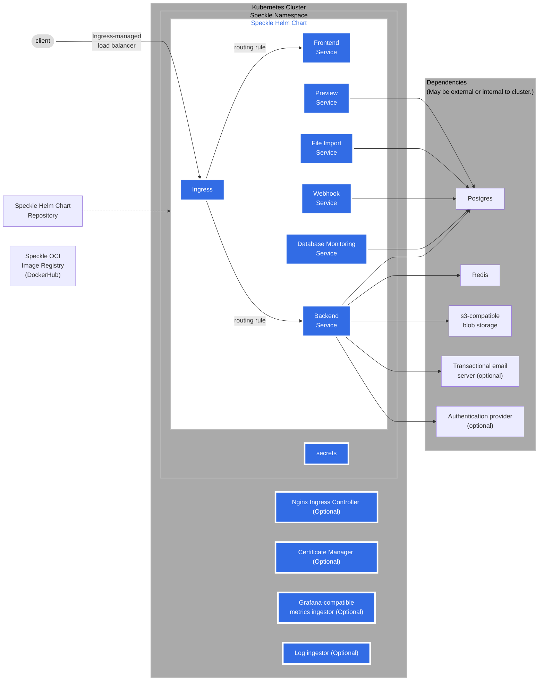

# Schematic Diagram

```mermaid
graph LR;
 client([client])-->|Ingress-managed <br> load balancer|ingress[Ingress];
 helmrepo["Speckle Helm Chart <br> Repository"]
 click helmrepo "https://specklesystems.github.io/helm/" _blank
 imageregistry["Speckle OCI <br> Image Registry <br> (DockerHub)"]
 click imageregistry "https://hub.docker.com/r/speckle/speckle-server" _blank
 helmrepo-.->helm;

 subgraph helm[Speckle Helm Chart]
 ingress;
 ingress-->|routing rule|svcfrontend[Frontend <br> Service];
 ingress-->|routing rule|backend[Backend <br> Service];
 svcfrontend;
 backend;
 preview[Preview <br> Service];
 fileimport[File Import <br> Service];
 webhook[Webhook <br> Service];
 databasemonitor[Database Monitoring <br> Service];
 end

 subgraph namespace[Speckle Namespace]
 helm;
 secrets;
 end

 subgraph cluster[Kubernetes Cluster]
 nginx["Nginx Ingress Controller (Optional)"];
 certmanager["Certificate Manager (Optional)"];
 monitoring["Grafana-compatible <br> metrics ingestor (Optional)"];
 logging["Log ingestor (Optional)"];
 namespace;
 end

 preview-->postgres;
 fileimport-->postgres;
 webhook-->postgres;
 databasemonitor-->postgres;
 backend-->postgres;
 backend-->redis;
 backend-->blobstore;
 backend-->emailserver;
 backend-->authprovider;

 subgraph externalDependencies["Dependencies <br> (May be external or internal to cluster.)"]
 postgres[Postgres];
 redis[Redis];
 blobstore[s3-compatible <br> blob storage];
 emailserver["Transactional email <br> server (optional)"];
 authprovider["Authentication provider <br> (optional)"];
 end
 classDef plain fill:#ddd,stroke:#fff,stroke-width:4px,color:#000;
 classDef k8s fill:#326ce5,stroke:#fff,stroke-width:4px,color:#fff;
 classDef cluster fill:#aaa,stroke:#bbb,stroke-width:2px,color:#000;
 classDef helm fill:#fff,stroke:#bbb,stroke-width:2px,color:#326ce5;
 class ingress,test,svcfrontend,backend,preview,fileimport,webhook,databasemonitor,nginx,certmanager,monitoring,logging,secrets k8s;
 class client plain;
 class cluster,namespace,externalDependencies cluster;
 class helm helm;
```
